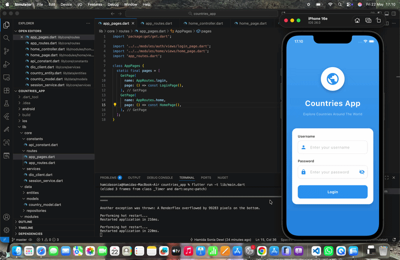

# Countries App 🌍

Flutter application with fake login and countries list using GetX, MVC pattern, Dio, SharedPreferences, and Equatable.

## Preview

<p align="center">
  
</p>

---

## Features

✅ Fake Login  
✅ Save Login Session using SharedPreferences  
✅ Auto Redirect when already login  
✅ Countries List from REST API  
✅ Display Country Name  
✅ Display Capital City  
✅ Display Country Flag  
✅ Pull To Refresh  
✅ Logout Feature  

---

## Tech Stack

- Flutter
- GetX
- Dio
- SharedPreferences
- Equatable
- MVC Pattern

---

## API

Using public API from:

```txt
https://restcountries.com/v3.1/all?fields=name,capital,currencies,flags